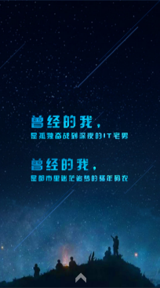
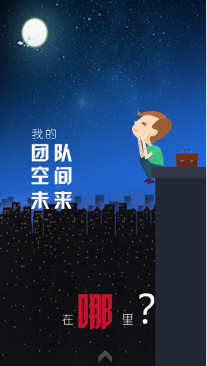

# 项目展示

swiper插件+jquery实现的一个微信动画小场景页面。

* [点击查看项目展示](http://SuDaoJun.github.io/animate/)

#  主要功能点

#### 1. 通过swiper实现动画的切换，延时

每个物体的图片通过div包裹，实现一个动画效果则给img图片加上swiper-animate-effect，duration，delay（切换动画，动画持续时间，动画延迟时间）属性，class类加上ani动画效果，如果实现二个效果则需要给div加上这些属性和类，每个物体则通过绝对定位absolute放好位置（这也是开始想实现多个动画效果而没有实现的原因所在）。

#### 2. 通过提示语点击物体实现显示隐藏动画

第三幅和第七幅动画根据提示语点击，js控制display来显示隐藏动画。

# 所遇问题

* 这是移动端的网页，在pc端显示会拉长画面，不适合pc端，所以应该限制pc端的使用，只有设备是移动端才可以操作动画效果
* 第三幅动画在有些手机上会出现人物下移一段距离的不兼容效果

# 交互及视觉说明

## 转角遇见她视觉图

## 曾经的我

## 我的未来

#  总结
####    这是使用swiper插件来实现移动端滑动动画特效，动画一直都是比较有趣的一方面，通过swiper插件的使用，让我们可以更加高效的实现效果和展示各种不同自己想设计的效果，不过发现好像前端插件相似的很多，所以要自己能慢慢的封装属于自己的独特插件才好，那样自己对于这方面的理解和学习将会有大大的提升。

